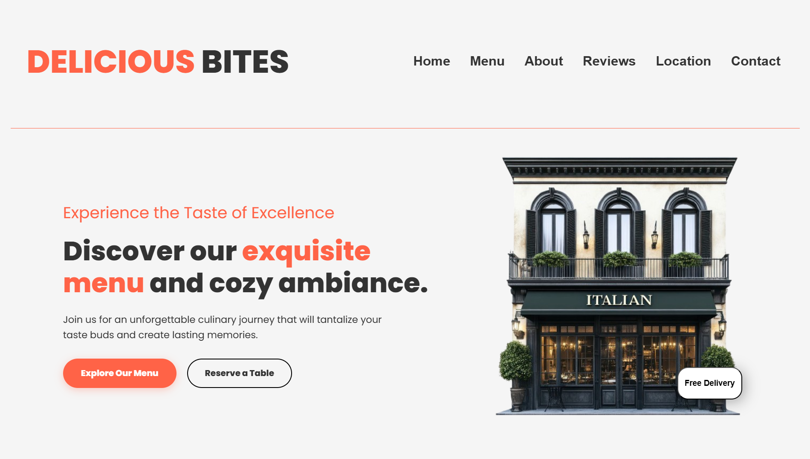
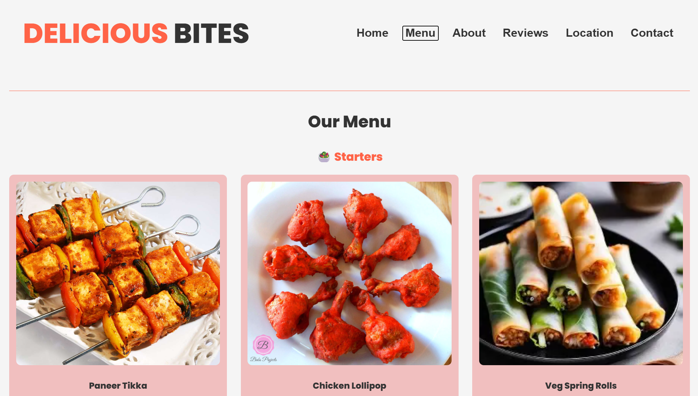

# 🍽️ Delicious Bites – Restaurant Website

A modern and responsive **Restaurant Website** built using HTML, CSS, and JavaScript.
It showcases a complete restaurant experience including menu, reviews, contact, and more.

---

## 🚀 Features

* 🏠 Home section with hero banner
* 📜 Interactive navigation (single-page sections)
* 🍛 Menu with images and pricing
* ⭐ Customer reviews section
* 📍 Location details
* 📞 Contact form
* 🖼️ Profile image & food images
* 🎯 Smooth section switching using JavaScript

---

## 🛠️ Technologies Used

* **HTML5** – Structure
* **CSS3** – Styling & layout
* **JavaScript** – Interactivity & navigation

---

## 📂 Project Structure

```bash
Restaurant-Website/
│── index.html
│── style.css
│── script.js
│
├── images/        # Food images (menu items)
├── asset/         # Profile 
├── preview/       # Screenshots for README
```

---

## 📸 Preview

### 🏠 Home Page



### 🍛 Menu Section



---

## ⚙️ How to Run

1. Download or clone the repository
2. Keep all folders (`images`, `asset`, `preview`) in the same directory
3. Open `index.html` in your browser

---

## 💡 How It Works

* Navigation buttons dynamically switch between sections using JavaScript
* Menu items are displayed using image cards
* Contact section allows user interaction (basic form UI)
* Images are loaded from structured folders for better organization

---

## 🔮 Future Improvements

* 🛒 Online ordering system
* 💳 Payment integration
* 📱 Better mobile responsiveness
* 🌐 Backend integration (Node.js / Firebase)
* ⭐ Live reviews & database storage

---

## 👨‍💻 Author

**Ayub Adil**
© 2026 All Rights Reserved

---

## 📌 Note

This project is designed to simulate a real-world restaurant website and demonstrate front-end development skills, including layout design, section-based navigation, and user interface structuring.
